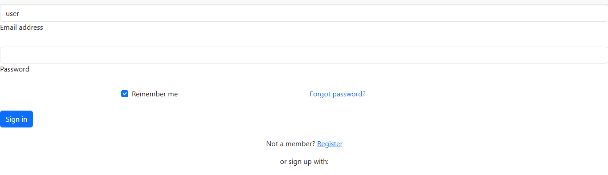
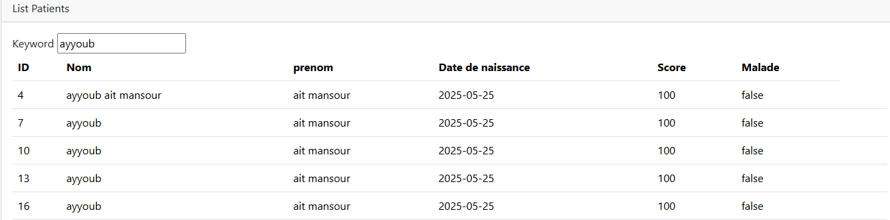
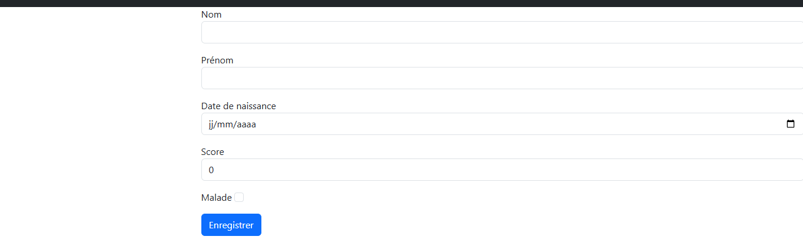
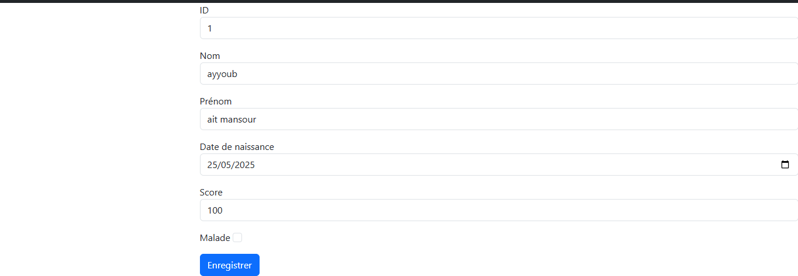
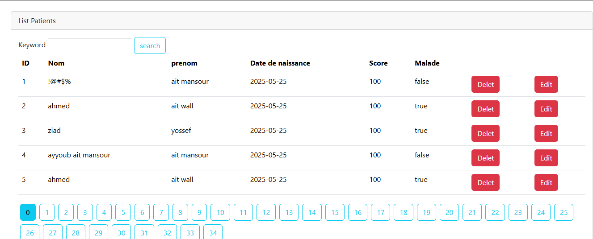

# Hospital App - Application de Gestion des Patients

## Auteurs

- **Nom :** Ayyoub  
- **Prénom :** Ait mansour 
- **Filière :**SDIA
- **TP :** TP3
##  Description du Projet

**Hospital App** est une application web développée avec **Spring Boot**, utilisant **Spring MVC**, **Thymeleaf**, **Spring Data JPA** et **Spring Security** pour la gestion complète des patients dans un environnement hospitalier.

##  Technologies Utilisées

- **Spring Boot 3.2.0**
- **Spring MVC** - Architecture Model-View-Controller
- **Thymeleaf** - Moteur de template pour les vues
- **Spring Data JPA** - Couche d'accès aux données
- **Spring Security** - Sécurisation de l'application
- **H2 Database** - Base de données en mémoire
- **Bootstrap 5.3.0** - Framework CSS pour l'interface
- **Maven** - Gestionnaire de dépendances
- **Java 17** - Version du langage

##  Architecture du Projet

```
src/
├── main/
│   ├── java/
│   │   └── ma.enset.hospitalapp/
│   │       ├── entities/
│   │       │   └── Patient.java
│   │       ├── repository/
│   │       │   └── PatientRepository.java
│   │       ├── security/
│   │       │   └── SecurityConfig.java
│   │       ├── web/
│   │       │   └── PatientController.java
│   │       └── HospitalApplication.java
│   └── resources/
│       ├── static/
│       ├── templates/
│       │   ├── editPatient.html
│       │   ├── formPatients.html
│       │   ├── login.html
│       │   ├── patients.html
│       │   └── template1.html
│       └── application.properties
```

##  Fonctionnalités Implémentées

###  Fonctionnalités de Base

1. **Affichage des Patients**
   - Liste complète des patients enregistrés
   - Affichage des informations : nom, date de naissance, état de santé, score

2. **Pagination**
   - Navigation par pages avec contrôle du nombre d'éléments par page
   - Affichage de 5 patients par page par défaut
   - Navigation intuitive entre les pages

3. **Recherche de Patients**
   - Recherche dynamique par nom de patient
   - Filtrage en temps réel avec conservation de la pagination
   - Recherche insensible à la casse

4. **Suppression de Patients**
   - Suppression sécurisée avec confirmation
   - Restriction d'accès aux administrateurs uniquement
   - Retour automatique à la page d'origine après suppression

###  Fonctionnalités de Sécurité

5. **Authentification et Autorisation**
   - **3 utilisateurs prédéfinis** :
     - `user1` / `user2` : Rôle USER (consultation uniquement)
     - `admin` : Rôles USER + ADMIN (toutes les opérations)
   - **Mot de passe commun** : `1234`
   - **Restriction d'accès** :
     - `/user/**` : Accessible aux utilisateurs authentifiés
     - `/admin/**` : Accessible aux administrateurs uniquement
     - `/deletePatient/**` : Réservé aux administrateurs

###  Améliorations Supplémentaires

6. **Template Réutilisable**
   - Template Bootstrap responsive et moderne
   - Navigation cohérente sur toutes les pages
   - Design professionnel avec thème médical

7. **Validation des Formulaires**
   - **Validation côté serveur** avec annotations Jakarta Validation
   - **Règles de validation** :
     - Nom : obligatoire, entre 4 et 40 caractères
     - Date de naissance : obligatoire
     - Score : minimum 10 points
   - **Affichage des erreurs** en temps réel
   - **Messages d'erreur personnalisés** en français

8. **Gestion CRUD Complète**
   - **Création** de nouveaux patients
   - **Lecture** avec pagination et recherche
   - **Modification** des informations patients
   - **Suppression** sécurisée

##  Captures d'Écran

###  Page de Connexion



###  Liste des Patients avec Pagination et search





###  Formulaire d'Ajout de Patient




### Formulaire de Modification



### 🛡️ Contrôle d'Accès Admin




